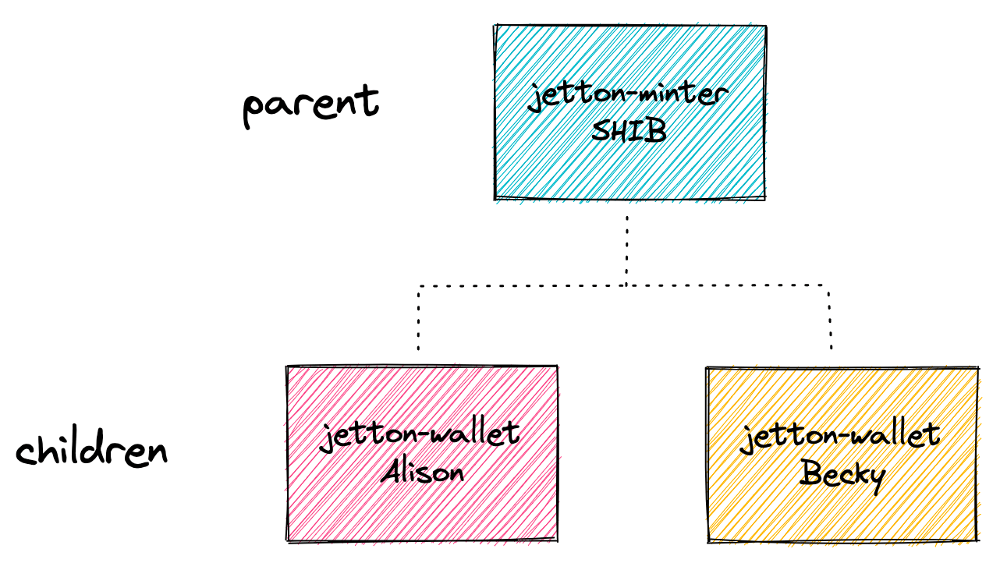

# UXLINK Token
UXLINK Governance Token, $UXLINK is to realize governance and capture benefits from UXLINK project and products.
Certainly! Here is the translation:

## Usage

```bash
yarn build          # Build and compile the contract
yarn test           # Run contract test cases
yarn deploy         # Deploy the contract
yarn mint           # Mint token
yarn transfer       # Transfer
yarn burn           # Burn
yarn updateOwner    # Update Owner
```

## ✨ Key Concepts



- Store Jetton content in the `Cell` data type.
- According to [TEP-74](https://github.com/ton-blockchain/TEPs/blob/master/text/0074-jettons-standard.md), use lowercase names in `get_jetton_data()`. Otherwise, major browsers will not correctly read Jetton information.
- The `max_supply` parameter is optional. You can choose to use it or not. In any case, browsers will only track `Total Supply` in the Jetton root contract.
- In Jettons, if you want to transfer Jetton tokens to someone, you need to send a message to your Jetton wallet, not the recipient's wallet.
- `forward_ton_amount` can be set as low as possible: similar to [TelemintNFT](https://github.com/TelegramMessenger/telemint). I don't know why, but it seems we can set (1e-9 TON) in `forward_ton_amount` without any errors.

## References

- [How to Shard Your TON Smart Contract and Why Studying the Anatomy of TON's Jettons](https://blog.ton.org/how-to-shard-your-ton-smart-contract-and-why-studying-the-anatomy-of-tons-jettons)
- [TEP-74 Jetton Standard](https://github.com/ton-blockchain/TEPs/blob/master/text/0074-jettons-standard.md)
- [TON Documentation - Asset Processing - Jettons](https://docs.ton.org/develop/dapps/asset-processing/jettons)
- [Tact Documentation - Learn Jetton](https://docs.tact-lang.org/learn/jetton/jetton-3)

## Community

- [UXLINK Community](Telegram UXLINK®)

## Deployment

To deploy the contract, you should:

1. Specify `contract.tact` as the contract entry point.
2. Configure `contract.deploy.ts` based on your `contract.tact` to generate the deployment link. Specifically, the Init() function in the contract needs to be called correctly.

If you rename `contract.tact` to something else, you need to update `tact.config.json` accordingly. For more information, see the [Tact Documentation](https://docs.tact-lang.org/language/guides/config).

## Testing

An example of contract testing is in `contract.spec.ts`. For more information on testing, see the [Tact Documentation](https://docs.tact-lang.org/language/guides/debug).

To add new test files to the contract, you should create `*.spec.ts` files similar to the template, which will be automatically included in the tests.
